To contribute in our rockets, everyone needs to pick an aspect of the rocket they want to contribute in.  Our student organization have three teams that contribute on different aspect of the rockets we build:
1. Design Team
2. Avionics Team
3. Software Team

**Frequent questions that I get from new members are:**
What does each of these teams do exactly? 
Which one should I pick?

Each of these teams have around 4-10 active members as of now. Everyone is welcomed to be a part of any of these teams regardless of your current majors. You can also pick more than one team initially!
# 1. Design Team: Rocket Science–Engines and Structures
The most fun part about being in the design team is to be able to get your hands dirty, in the lab & workshops! You'll be learning a suite of softwares that will allow you to design a rocket from scratch(example)! However, that is not the hard part. We chase real world excellence at RocketTech, so will you. 

You'll get to learn the underlying concepts that is the only way to learn how to engineer great things(that work!). For example:
- Static Stress Simulations
- Computational Fluid Dynamic(CFD) Simulations
- Aero Dynamics
- Shockwave Dynamics

### Their Work:
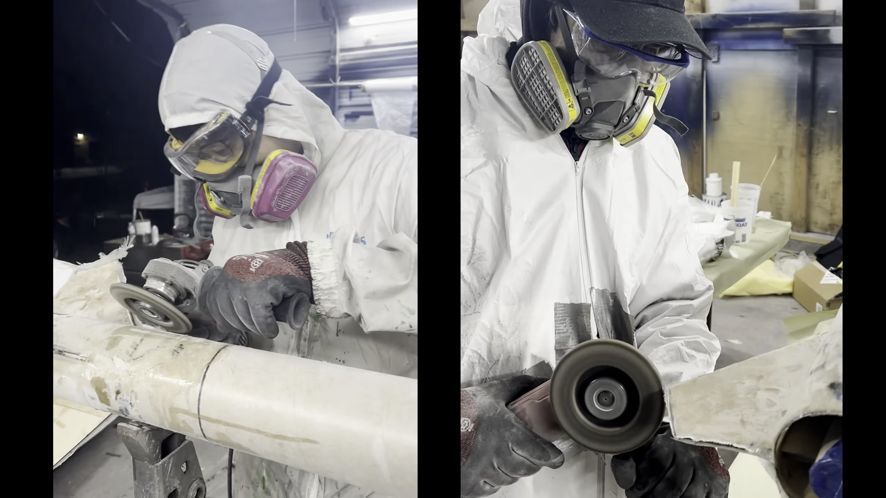
***Credits***: Our design team member–Renato 
***Shop Credits***: Salgado Autorepairs, Brian

***Credits***: Design team member–Brian

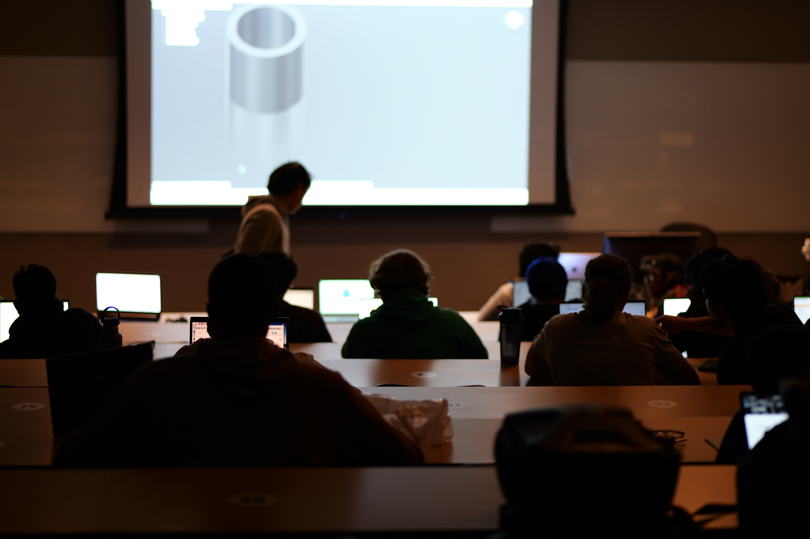

# 2. Avionics Team: Heart of the Rocket
You'll be learning a suite of softwares that will allow you to design a rocket from scratch! However, that is not the hard part. We chase real world excellence at RocketTech, so will you. 

You'll get to learn about and build the very electronics that will control important events in the rocket like data logging, parachute ejection, and trajectory control. For example:
- Engineering the Avionics(Electronics that goes into the Rocket)
- Engineering the Ground Station/Control Room Electronics
- Design the Sensor Suite
- PCB designing and fabrication
- Battery, Camera, Radio Frequency(RF) communication

However, that isn't it! Members of the avionics team also write software libraries(yes, the very packages that software team imports and use) from scratch! Meaning, you will be the embedding software engineers too! This will allow you to work at NASA, Lockheed Martin, Blue Origin, SpaceX, and the whole automobile and robotics industry! Incredible opportunities awaits...

Their Work:
AVIO MK 1:
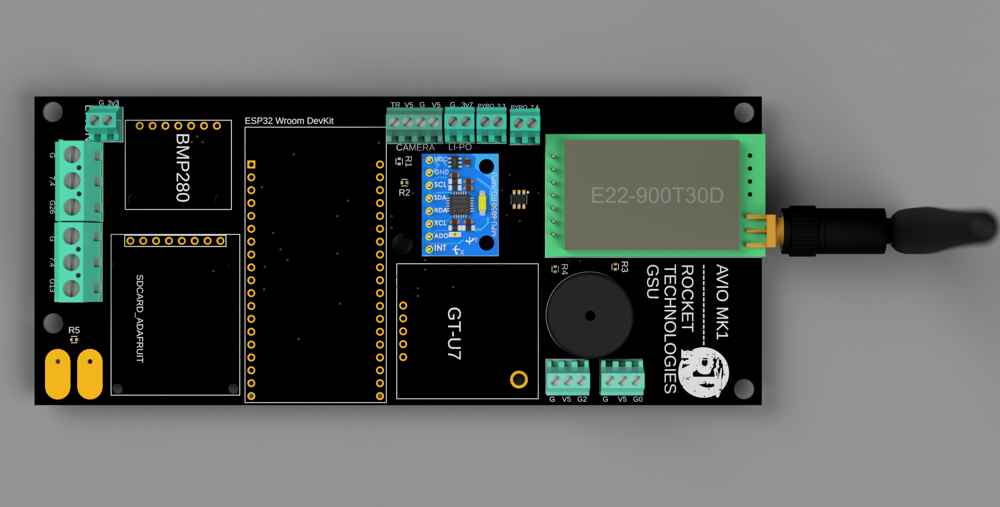
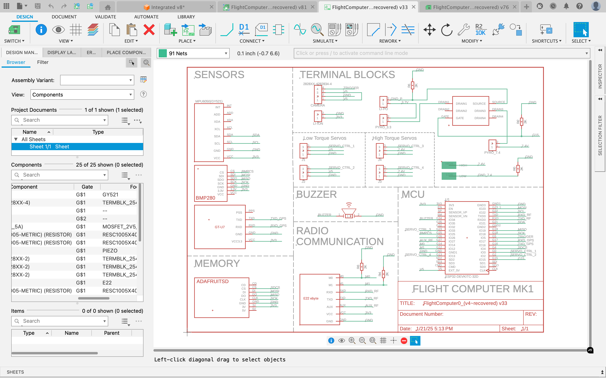
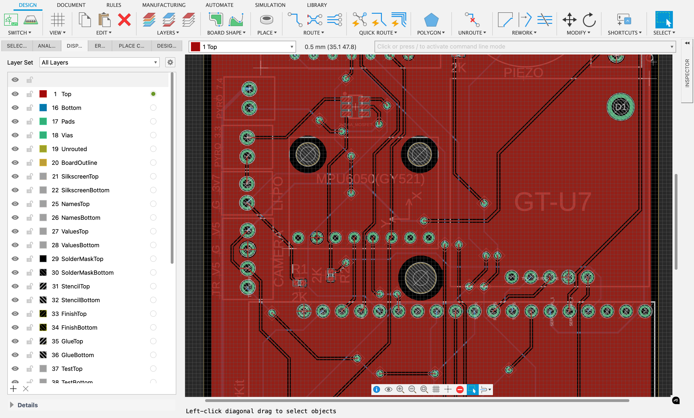
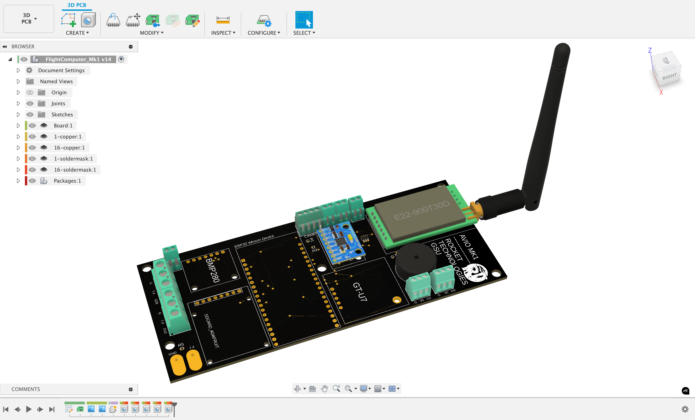
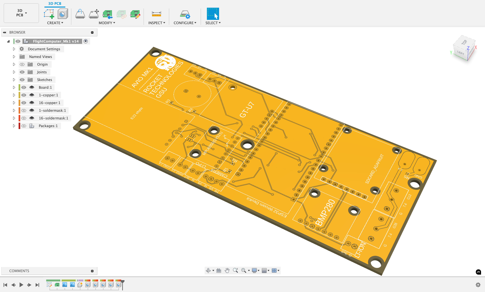
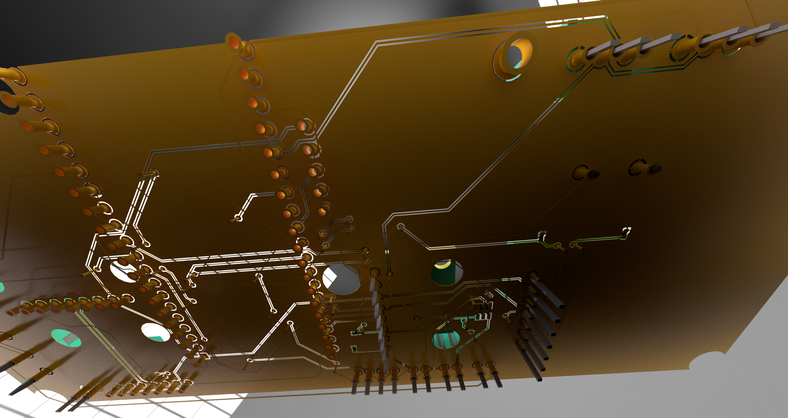

# 3. Software Team: Brain of the Rocket
Oh boy! Where do I even start. 
So for context, aerospace includes A LOTS, I mean A LOTS of sophisticated software. If you can make friends with the people on our server, withstand the initial pain, you will end up becoming an undoubtedly a great software engineer! 
Like for context, we haven't even fully finished any of our software just yet and one of our members who did just a few internship applications already got hired by for this summer as a software engineer.

## Current Software Projects:
### Guidance Navigation Control: [GNC_to_the_moon](https://github.com/rocket-tech-gsu/GNC_to_the_moon)
- 1. Guidance Software:
  - A software that calculates the optimal path for a mission. It is required for mission planning. It also live generate/adjust for joining the path to connect where the Rocket is currently to stay closest to the original path.
  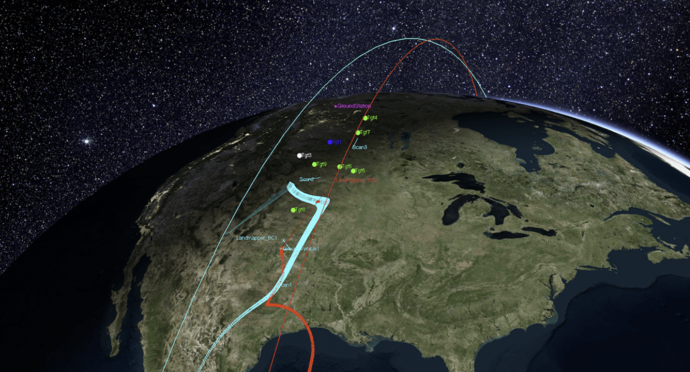
  *Image credits: RocketLab*
- 2. Navigation Software:
  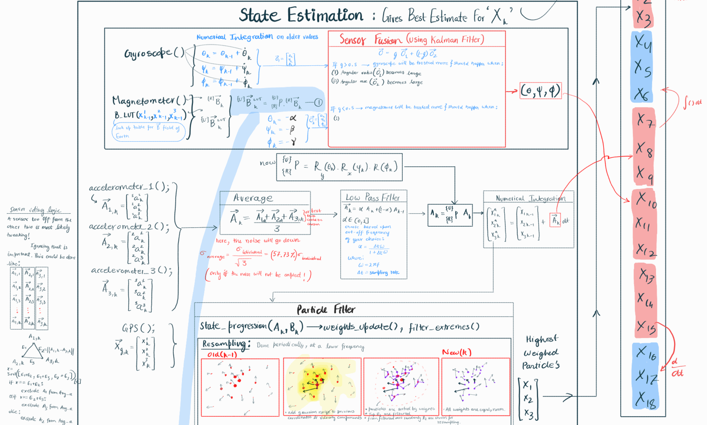
  - A software that converts senseless voltages coming from a diverse suite of sensors into highly precise and highly accurate:
    - location,
    - velocity,
    - acceleration
    - orientation,
    - angular velocity,
    - angular acceleration
  - This happens live, many times a second on-board during the flight!

- 3. Control Software:
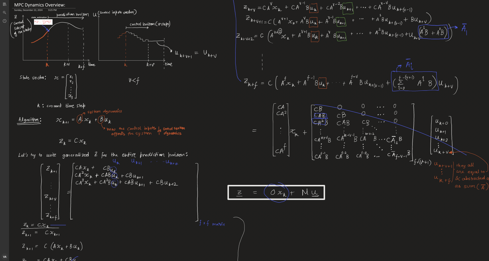
  - A software that takes input the ***Navigation software's output***, **Path generated by the Guidance Software** to understand the best next values for actuators controlling the thrust direction of the rocket engine.
    - The fallback mode will run the Model Predictive Control algorithm. This is safe and reliable.
    - This is in the driver seat of the rocket(metaphorically). It manuevers the rocket on to the desired path.
  - ***Reinforcement Learning*** based achieve the best results for this. However, this brings up to another requirement.

- 3.5 System Dynamics:
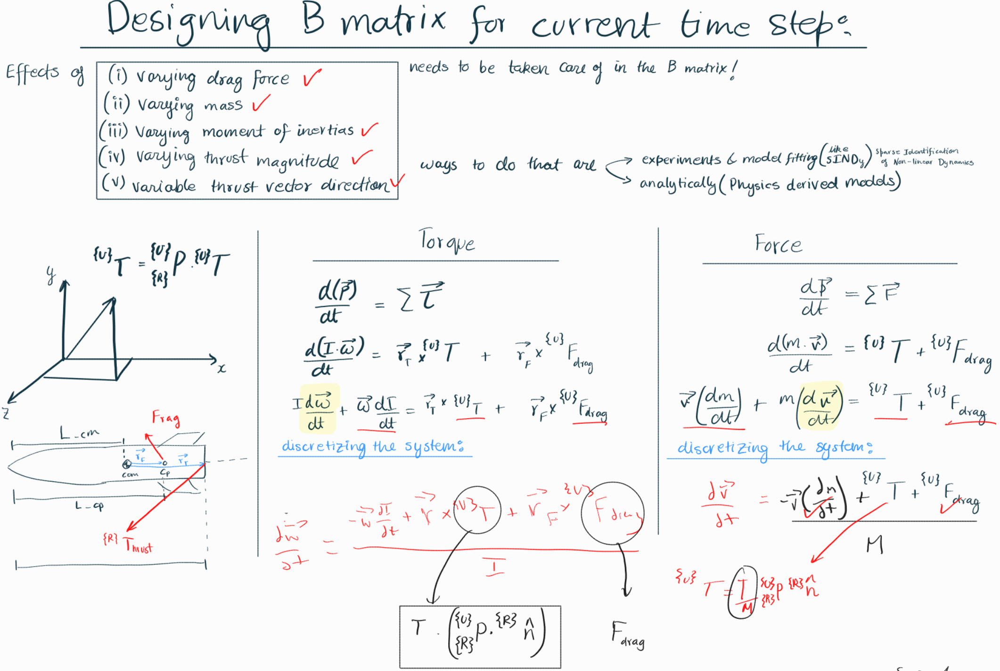
  - A really accurate Computational-Mathematical-Physics Model of the real world is required to model for example the rocket's behavior will be for current predictions given actuator values. This prediction is done ahead in time, live, to plan ahead.
  - This is 6 degrees of freedom, high fedility model which in-turn includes a lots of Computational Fluid Dynamics software! We are choosing to keep everything opensource. OpenFOAM is the already existing open source CFD software which we will be building on.
  - CFD Details are on the github. Just know that it is what can get you into the aerospace software industry!

There are A LOT more happening in the software team. You'll have to be active on the server & meetings to learn things and start contributing. I hope these opportunity can be the GNC system of the trajectory of your life :))

## Finally:
- You can join any team regardless of your major. We want you to listen to your heart.
- Participate, engage, learn, push yourself, grow.
- Every great work is a group effort. Do not spend your education journey in a vacuum. 

***Image Credits: Ken Karbon, Apogee Components***

***Image Credits: CFDSupport***
