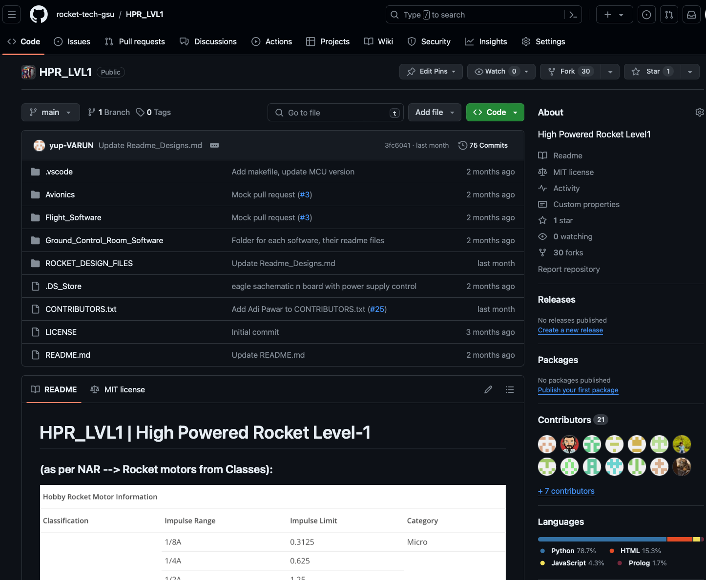

Rocket Technologies GSU launched Three High-Powered-Rockets on April 5th at a launch event hosted by the *SouthEast Alabama Rocketry Society*, or SEARS(a sport rocketry club), at [Southeast Alabama](https://www.google.com/maps/place/Sod+Rd,+Alabama+36477/@31.1207765,-86.0859942,17z/data=!3m1!4b1!4m5!3m4!1s0x88923caf8b32d3a1:0xd1979b9871c2eb57!8m2!3d31.1207765!4d-86.0838055?shorturl=1).

The Rockets were for certifications, for the following members:
- Keara - HPR Level 1 Certification Launch Attempt
- Barry - HPR Level 1 Certification Launch Attempt
- Varun Ahlawat - HPR Level 2 Certification Launch Attempt
 and:
- Chisom Maxwell - volunteered help

## HPR Level-1 Flights and Learnings:
- Both Keara's and Barry's Level 1 High Powered Rockets had successful certification flights. 
- Both of their rocket's were Loc-IV kits, they both used H219t Rocket Motors from Apogee.
- Keara's rocket saw minor zipper damage. This could have been prevented if we would've used CA superglue on the opening edge of the body tube. This makes it stronger and cardboard don't wither away this way.
  - This happened due to the shock chord being too thin.
  - Barry's kit, even though the same, had thicker shock chord.
  - Loc IV's shock chord varies in quality - a thicker shock chord is always better.

### Photos:

  
  
  
  

## HPR Level-2 Flights and Learnings:

- Varun's Level-2 Rocket had a perfect flight:
<iframe width="560" height="315" src="https://www.youtube.com/embed/qACj-c9Kn5M?si=p9vvqWlr5tEHdUsF" title="YouTube video player" frameborder="0" allow="accelerometer; autoplay; clipboard-write; encrypted-media; gyroscope; picture-in-picture; web-share" referrerpolicy="strict-origin-when-cross-origin" allowfullscreen></iframe>

- The recovery was also perfect except the fact that we weren't able to find where it landed. Strong winds increased it drift so much that it ended up in the woods next to the launch field.
- Total lateral drift for 7m/s was simulated to be around 1050m.

### This could have been prevented in the following ways:
  - Simulate different launch rod pitch angles, keep increasing the pitch in the direction of the winds until the ascent drift of the rocket equalize the lateral drift caused by the wind during descent.
    - Overlap the drift and use maps to measure distances in the wind direction so landing site isn't near dense woods.
  - Do not deploy the main parachute at apogee, instaed use dual deployment:
    - Deploy a small parachute(called drogue chute) at the apogee.
    - When only 50-100 meters above the ground, deploy the main parachute.
  - Have an off the shelf GPS tracker on board like TeleGPS. Ramblin Rockets teams from GaTech also uses this.

### Photos:

  
  
  
  
  
  
  

# Next Steps:
- We will make it a protocol that before every launch we sit down on the launch site and measure and then simulate the wind and overlay the lateral distance on maps to make sure landing site isn't in the woods.
- Our avionics and software teams have mastered the event detection algorithm. We can now experiment with custom electronic deployment and master any sophistication of deployment. We are waiting on getting our custom avionics board manufactured called **AvioMk 1**.
- We will order level 2 kits and hopefully launch 2-3 level 2 rockets on May 10th.