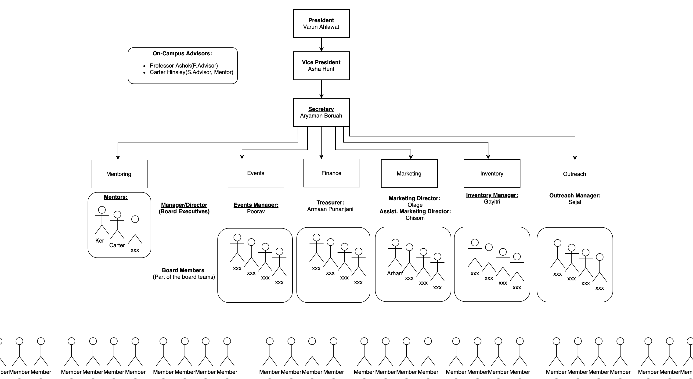
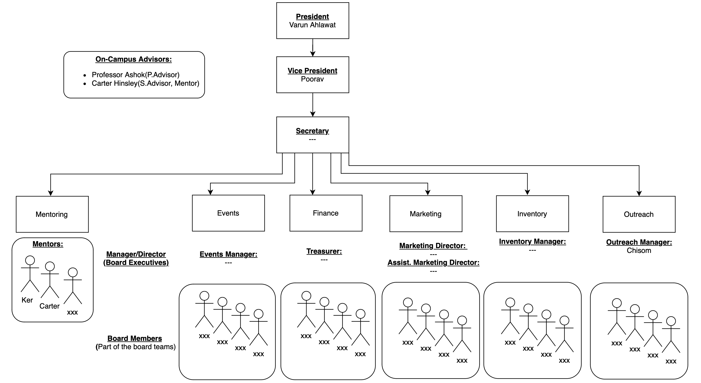

**Board Positions [Application](https://forms.gle/3BC4WtEvXc1e6k9W9) for fall 2024 is open! Apply Today!**

**Application Deadline: September, 7th**

# Why do we exist?

To prove that the academia could also be made enjoyable while preparing us for real life! Say you want to learn finance, what better way to learn it by managing finance of a rocket company?(or in this case a student organization)?

You see, our operations are more than that of a just student club. Future cinematographers, digital marketeers, human resource, lawyers, physicists, chemists, mathematicians, software engineers, aerospace engineers get to live their future right now, at Rocket Tech!

It was officially registered in Spring2024, however, began operations in the winter break after fall 2023.

- [Join our Discord!](https://discord.gg/bQRxApcucn)
- [Join the organization on PIN](https://pin.gsu.edu/organization/rocket_tech)

# Fall2024 Meeting Schedule

- A new Schedule will be up soon. If you've joined us on PIN, you'll be notified about all our events via email.
- Feel free to drop by any of our general meetings -- there are no strict requirements.
- Last semester we met every single week, our meetings were like that of a close family of excited individuals.

# Our Executive Board

Apply for open board positions [here](https://forms.gle/3BC4WtEvXc1e6k9W9).

Application Deadline: **September, 7th**

Besides On-Campus Advisors & Mentors there are the following departments:
### Departments:
1. Events
2. Finance
3. Marketing
4. Inventory
5. Outreach

### Heirarchical Structure:
1. Board Executive: Student Leaders
2. Board Members

*Past View: Spring 2024*

**This was the organization in Spring 2024. However, currently, most board executive and board member positions are open for students:**

*Current View: Fall 2024*

### Open Positions(as of Aug 23, 2024):
- Secretary
- Marketing Director
- Finance Director
- Events Director
- Inventory Director

***Application Deadline: September, 2nd Week, 2024***

### Current Student Leaders:

    

        
        <h3>Varun Ahlawat</h3>
        
President

        
        
    

    

        
        <h3>Poorav</h3>
        
Vice President

        
        
    

    

        
        <h3>Chisom</h3>
        
Outreach Director

        
        
    

    

        
        <h3>Carter Hinsley</h3>
        
Co-Advisor &amp; Mentor

        
        
    

